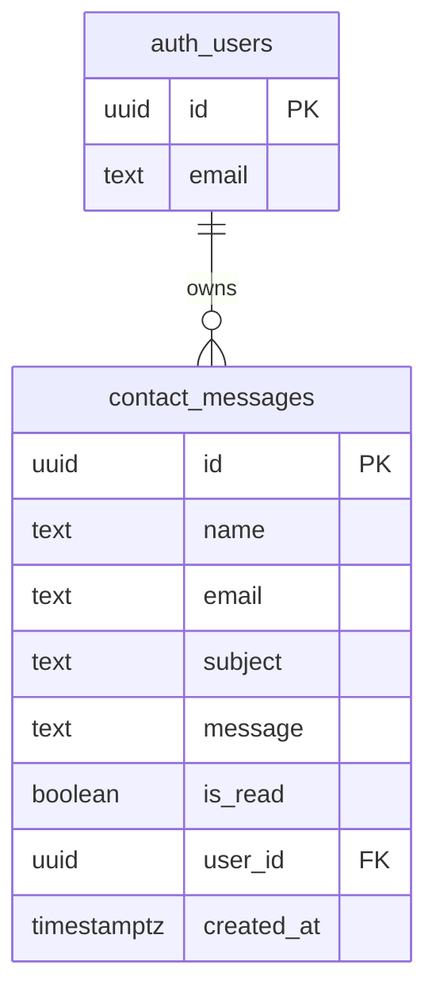

# Supabase Design — Masudul Hasan Portfolio

> Project ref: `alxfiyywszzzhskdvotn` · Live site: `masudulhasan.me` · Repo: `masudul2002/masudul2002.github.io` (GitHub Pages, no build step)

## Architecture overview

```
┌─────────────────────┐        ┌──────────────────────┐
│  Visitor            │        │  Admin (you)         │
│  index.html         │        │  admin.html          │
│  contact form       │        │  login + messages    │
└─────────┬───────────┘        └──────────┬───────────┘
          │ INSERT (anon role)            │ SELECT/UPDATE/DELETE
          │                                │ (authenticated role)
          ▼                                ▼
┌─────────────────────────────────────────────────────────┐
│                    Supabase Project                     │
│  ┌──────────────────────────────────────────────────┐   │
│  │  contact_messages (public)  ← RLS enforced        │   │
│  │  - anon:            INSERT allowed only           │   │
│  │  - authenticated:   own rows only                │   │
│  └──────────────────────────────────────────────────┘   │
│  Auth: email/password, public signup DISABLED           │
│  (only the admin user exists)                          │
└─────────────────────────────────────────────────────────┘
```

## Why this design

- **Pure static site** (GitHub Pages, no server) → Supabase is loaded from a CDN and the anon key is public in the browser. **RLS is therefore the only protection** between visitors and the data — it is mandatory, not optional.
- **Visitors** only ever need `INSERT` (submit the form). They must never `SELECT`, `UPDATE`, or `DELETE`.
- **Admin** logs in with email/password. To keep things safe, messages are linked to the admin via `user_id`, and every read/update/delete policy requires `auth.uid() = user_id` — so even a second authenticated user (if one ever existed) could not see anything.

## ER Diagram



## Tables

### `public.contact_messages`

| Column      | Type         | Constraints            | Purpose                          |
|-------------|--------------|------------------------|----------------------------------|
| `id`        | `uuid`       | PK, default `gen_random_uuid()` | Row identifier           |
| `name`      | `text`       | NOT NULL               | Sender name                      |
| `email`     | `text`       | NOT NULL               | Sender email                     |
| `subject`   | `text`       | DEFAULT `''`           | Message subject (optional)       |
| `message`   | `text`       | NOT NULL               | Message body                     |
| `is_read`   | `boolean`    | DEFAULT `false`        | Admin read status                |
| `user_id`   | `uuid`       | FK → `auth.users(id)`, nullable | Owner (admin); NULL = not yet claimed |
| `created_at`| `timestamptz`| DEFAULT `now()`        | Submission time                  |

**Indexes:** `created_at DESC` (admin list order), `user_id` partial (ownership lookups).

## RLS Policy Matrix

| Role          | SELECT | INSERT | UPDATE | DELETE |
|---------------|--------|--------|--------|--------|
| `anon` (visitors) | ❌ denied | ✅ allowed (`WITH CHECK (true)`) | ❌ denied | ❌ denied |
| `authenticated` (admin) | ✅ all rows | ❌ denied (admin never inserts via UI) | ✅ all rows | ✅ all rows |
| `service_role` (Supabase backend) | ✅ full access (bypasses RLS) | ✅ | ✅ | ✅ |

> **Why "all rows" for the admin:** Public signup is disabled, so there is exactly one authenticated user — the admin. Messages are inserted as `anon` with no owner, so an `auth.uid() = user_id` policy would require a manual claim step. Granting `authenticated` full access keeps the page zero-maintenance while remaining admin-only by construction. Revisit only if more users are ever added.

## Auth configuration

| Setting                    | Value            |
|----------------------------|------------------|
| Provider                   | Email (password) |
| Email signup (public)      | **DISABLED** — only the pre-created admin account can log in |
| Confirm email              | On (recommended) |
| Admin account              | Created via `auth.admin.createUser` with `email_confirm: true` |
| Session                     | Stored by supabase-js in localStorage (default) — no conflict with the site's `theme` key |

## Data flow

1. Visitor fills the contact form on `index.html` → `supabase.from('contact_messages').insert([{ name, email, subject, message }])` (anon role).
2. RLS allows the insert; `user_id` stays NULL.
3. WhatsApp opens as before (existing behavior preserved; fallback if the DB call fails).
4. Admin opens `admin.html` (unlisted URL) → email/password login.
5. Admin loads messages: `select * from contact_messages order by created_at desc` — all rows visible, no manual claim needed.

## Deploy & rollback

- `git push origin main` → GitHub Pages auto-deploys (~1–2 min).
- Backup branch: `backup/pre-supabase` (baseline before any Supabase work).
- Rollback: `git revert HEAD` · full restore: `git reset --hard backup/pre-supabase && git push --force-with-lease origin main`.
- Schema rollback: `DROP POLICY IF EXISTS` each policy, then `ALTER TABLE public.contact_messages DISABLE ROW LEVEL SECURITY;` and `DROP TABLE IF EXISTS public.contact_messages;`

## Files that changed

| File | Purpose |
|------|---------|
| `supabase/schema.sql` | Table + RLS policies (idempotent, run in SQL editor) |
| `supabase-config.js` | Supabase client init (public anon key) |
| `index.html` | Added supabase CDN + config scripts in `<head>` |
| `script.js` | `send-btn` handler: insert to DB, then WhatsApp (fallback preserved) |
| `admin.html` | Private admin page: login, messages, mark-read, delete, change password |
